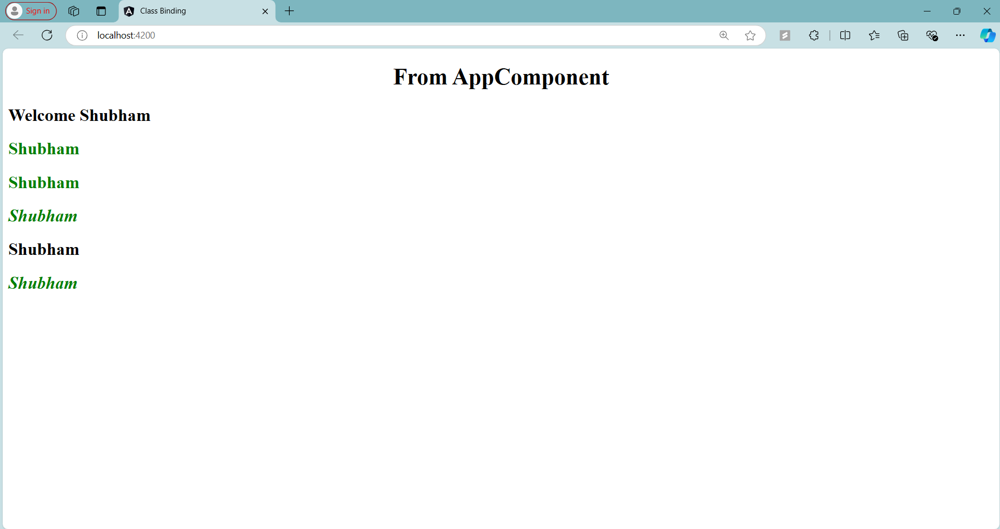

# Angular Class Binding - TestComponent

## Overview

In this step, I learned about **Class Binding** in Angular. Class binding allows you to bind HTML element classes dynamically based on the properties or conditions in your component. This can help you apply or remove classes on elements without hardcoding them, based on the component's logic.

### **Class Binding Syntax:**

There are two main ways to bind classes dynamically:
1. **Single Class Binding**: `[class.className]="condition"`
2. **Multiple Classes with `ngClass`**: `[ngClass]="objectOfClasses"`

### **Code Explanation**

Here is the code for the `TestComponent` that demonstrates various class binding techniques:

```typescript
import { Component } from '@angular/core';

@Component({
  selector: 'app-test',
  template: `
            <h2>
              Welcome {{name}}
            </h2>
            <h2 class="text-success">Shubham</h2>
            <h2 [class]="successClass">Shubham</h2>

            <h2 class="text-special" [class]="successClass">Shubham</h2>
            <h2 [class.text-danger]="hasError">Shubham</h2>
            <h2 [ngClass]="messageClasses">Shubham</h2>
            `,
  styles: [`
    .text-success {
      color: green;
    }
    .text-danger {
      color: red;
    }
    .text-special {
      font-style: italic; 
    }
    `]
})
export class TestComponent {

  public name  = "Shubham";
  public successClass = "text-success";
  public hasError = false;
  public isSpecial = true;

  public messageClasses = {
    "text-success": !this.hasError,
    "text-danger": this.hasError,
    "text-special": this.isSpecial
  }
}
```

### 1. **Static Class Binding**:
```html
<h2 class="text-success">Shubham</h2>
```
- This line statically assigns the class `text-success` to the `<h2>` element.
- In this case, the text will always be green because of the associated CSS class:
  ```css
  .text-success {
    color: green;
  }
  ```

### 2. **Single Class Binding**:
```html
<h2 [class]="successClass">Shubham</h2>
```
- Here, the class is being dynamically bound to the value of `successClass` in the component.
- Since `successClass = "text-success"`, the `text-success` class will be applied to the element, turning the text green.
- If the value of `successClass` were changed to another class, that new class would be applied dynamically.

### 3. **Combining Static and Dynamic Classes**:
```html
<h2 class="text-special" [class]="successClass">Shubham</h2>
```
- In this line, both a **static class** (`text-special`) and a **dynamic class** bound through property binding (`[class]="successClass"`) are applied to the element.
- The `text-special` class makes the text italic, and the `text-success` class makes the text green.

### 4. **Conditional Class Binding**:
```html
<h2 [class.text-danger]="hasError">Shubham</h2>
```
- This binds the `text-danger` class to the `<h2>` element based on the value of `hasError`.
- If `hasError = true`, the `text-danger` class will be applied, making the text red. If `hasError = false` (as in this example), the class will not be applied.
  
This is a way to dynamically control whether a class is applied or not based on a condition.

### 5. **Binding Multiple Classes with `ngClass`**:
```html
<h2 [ngClass]="messageClasses">Shubham</h2>
```
- `ngClass` allows you to bind **multiple classes** to an element.
- The `messageClasses` object defines which classes should be applied:
  ```typescript
  public messageClasses = {
    "text-success": !this.hasError,
    "text-danger": this.hasError,
    "text-special": this.isSpecial
  }
  ```
  - `text-success`: Applied if `!this.hasError` (i.e., when there is **no error**).
  - `text-danger`: Applied if `this.hasError` (i.e., when there **is an error**).
  - `text-special`: Applied if `this.isSpecial` is `true`.

In your current case:
- Since `hasError = false`, `text-success` and `text-special` are applied, turning the text green and italic.
  
If `hasError` were set to `true`, the text would become red because the `text-danger` class would be applied instead.

---

### Final Output:
- The first `<h2>` element displays "Welcome Shubham" with no dynamic class binding.
- The second `<h2>` element binds the `text-success` class dynamically, making the text green.
- The third `<h2>` element combines the static `text-special` class (italic) and the dynamic `text-success` class (green).
- The fourth `<h2>` element applies `text-danger` only if `hasError` is true.
- The fifth `<h2>` element uses `ngClass` to conditionally apply multiple classes, making the text green and italic.

---

### Screenshot


