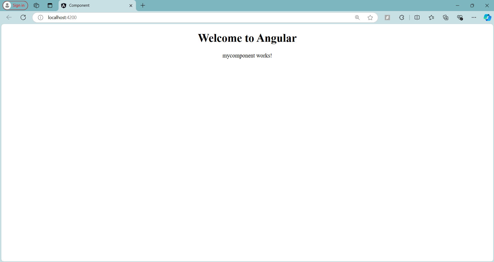

# Angular Component - "First"

## Overview

In this step, I created a new Angular component named **FirstComponent**. This component showcases three different methods of including components in Angular applications:

1. **Custom HTML Tag**
2. **CSS Class**
3. **Attribute Directive**

## Component Code

Here’s the code for the `FirstComponent`:

```typescript
import { Component } from '@angular/core';

@Component({
  selector: 'app-first',  // Custom HTML tag
  // selector: '.app-first',  // Adding as a CSS class
  // selector: '[app-first]',   // Adding as an attribute
  templateUrl: './first.component.html',
  styleUrls: ['./first.component.css']
})
export class FirstComponent {
}
```

## Including the Component

You can include the `FirstComponent` in your application using any of the following methods:

### 1. Using Custom HTML Tag

```html
<app-first></app-first>  
```

### 2. Using CSS Class

```html
<div class="app-first"></div>
```

### 3. Using Attribute Directive

```html
<div app-first></div>
```

## Example Usage

Below is an example of how to include the component within a template:

```html
<div style="text-align: center;">
  <h1>Welcome to Angular</h1>
  
  <!-- Adding component as custom HTML tag -->
  <app-first></app-first>  
  
  <!-- Adding component as a CSS class -->
  <!-- <div class="app-first"></div> -->

  <!-- Adding component as an attribute -->
  <!-- <div app-first></div> -->
</div>
```

## Screenshot



---
