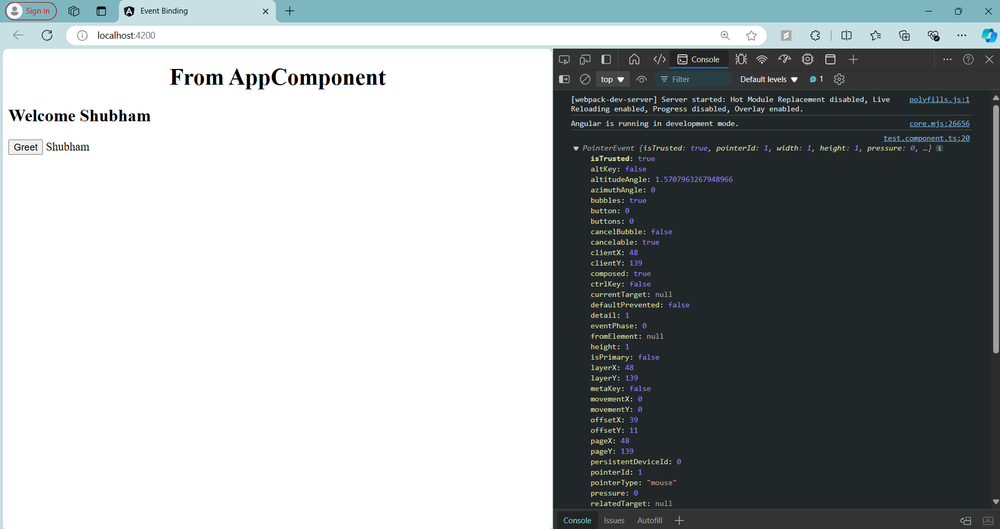

# Angular Event Binding - TestComponent

## Overview

In this step, I learned about **Event Binding** in Angular. Event binding allows you to listen for and respond to user interactions such as mouse clicks, key presses, or form submissions. This mechanism connects DOM events to component methods.

### **Event Binding Syntax**:
- **Basic Syntax**: `(eventName)="eventHandler($event)"`
  - `eventName`: The name of the event, such as `click`, `input`, `keyup`, etc.
  - `eventHandler($event)`: The method in the component that gets executed when the event occurs. The `$event` object contains information about the event.

### **Code Explanation**

Here is the code for the `TestComponent` that demonstrates event binding:

```typescript
import { Component } from '@angular/core';

@Component({
  selector: 'app-test',
  template: `
            <h2>
              Welcome {{name}}
            </h2>
            <button (click)="onClick($event)">Greet</button>
            {{greeting}}
            `,
  styles: []
})
export class TestComponent {

  public name = "Shubham";
  public greeting = "";

  onClick(event: MouseEvent) {
    console.log(event);
    this.greeting = "Shubham";
  }
}
```

### 1. **Button Click Event Binding**:
```html
<button (click)="onClick($event)">Greet</button>
```
- This line binds the **click** event of the `<button>` element to the `onClick()` method defined in the component.
- When the user clicks the button, the `onClick()` method is invoked.

### 2. **Event Handler (`onClick`)**:
```typescript
onClick(event: MouseEvent) {
  console.log(event);
  this.greeting = "Shubham";
}
```
- The method `onClick` accepts the **click event** object `event: MouseEvent` as a parameter.
- It prints the event details to the browser's console using `console.log(event);`. This can provide useful information such as the coordinates of the mouse when the button was clicked.
- The method also updates the `greeting` property with the string `"Shubham"`. This change is immediately reflected in the template due to Angular’s two-way data binding.

### 3. **Displaying the Greeting**:
```html
{{greeting}}
```
- This interpolation dynamically updates the UI whenever the `greeting` property is updated.
- Initially, the `greeting` value is an empty string, so nothing is displayed.
- After clicking the button, the `greeting` value becomes `"Shubham"`, and this value is rendered in the view.

### Final Output:
- The page initially displays a welcome message: `Welcome Shubham`.
- When the user clicks the **Greet** button, the event binding invokes the `onClick()` method, which:
  - Logs the event object in the console.
  - Updates the `greeting` property to `"Shubham"`.
- The updated greeting message `"Shubham"` is then displayed below the button.

---

### Screenshot

