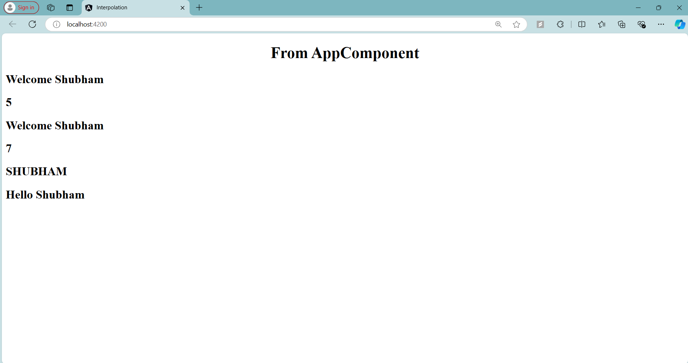

# Angular Interpolation - TestComponent

## Overview

In this step, I learned about **Interpolation** in Angular, which allows data binding from the component's TypeScript file to the HTML template. Below is the code for the `TestComponent` where interpolation is used to display dynamic data and expressions.

Interpolation in Angular is a technique that allows you to bind data from your component's TypeScript file to the view (HTML). It’s commonly used to display data dynamically in templates by embedding the component's properties or expressions within double curly braces {{ }}.

### TestComponent Code

```typescript
import { Component } from '@angular/core';

@Component({
  selector: 'app-test',
  template: `
            <h2>
              Welcome {{name}}
            </h2>
            <h2>{{2+3}}</h2>
            <h2>{{"Welcome " + name}}</h2>
            <h2>{{name.length}}</h2>
            <h2>{{name.toUpperCase()}}</h2>
            <h2>{{greetUser()}}</h2>
            `,
  styleUrls: []
})
export class TestComponent {

  public name  = "Shubham";

  greetUser(){
    return "Hello " + this.name;
  }
}
```

### Key Interpolation Examples:

1. **Displaying a Component Property**: `{{name}}`
2. **Evaluating Expressions**: `{{2+3}}`
3. **String Concatenation**: `{{"Welcome " + name}}`
4. **Accessing Property Methods**: `{{name.length}}`
5. **Calling Methods**: `{{name.toUpperCase()}}`
6. **Calling a Component Method**: `{{greetUser()}}`

### Final Output:

- **Welcome Shubham**
- **5**
- **Welcome Shubham**
- **7**
- **SHUBHAM**
- **Hello Shubham**

---

## Screenshot



