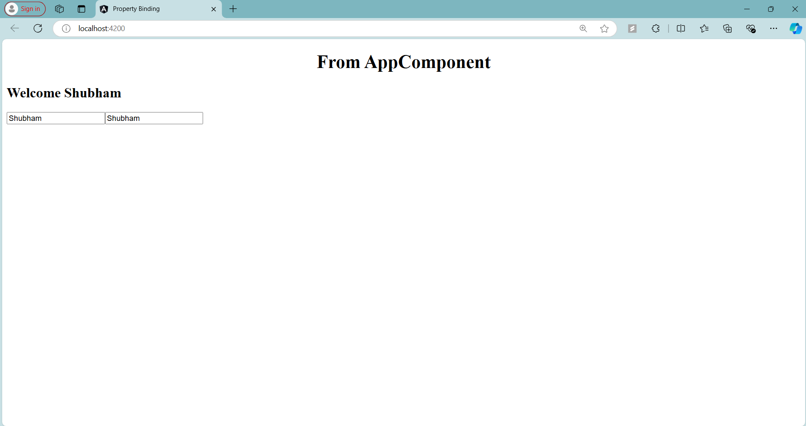

# Angular Property Binding - TestComponent

## Overview

In this step, I learned about **Property Binding** in Angular. Property binding is a technique used to bind values from the component class to the HTML element properties dynamically. Angular property binding allows you to control DOM properties by binding them to component class fields.

### **Property Binding Syntax:**
```html
[element-property]="component-property"
```
- The value of `element-property` is set based on the value of `component-property`.
- This is different from interpolation `{{ }}` because property binding targets DOM properties directly.

### **Code Explanation**

Below is the code for the `TestComponent` which demonstrates property binding:

```typescript
import { Component } from '@angular/core';

@Component({
  selector: 'app-test',
  template: `
            <h2>
              Welcome {{name}}
            </h2>
            <input [id]="myId" type="text" value="Shubham">
            <input [disabled]="isDisabled" id="{{myId}}" type="text" value="Shubham">
            `,
  styleUrls: []
})
export class TestComponent {

  public name  = "Shubham";
  public myId = "testId";
  public isDisabled = false;

}
```

### **Explanation of Property Binding Examples:**

1. **Binding the `id` Property:**
   ```html
   <input [id]="myId" type="text" value="Shubham">
   ```
   - Here, the `id` attribute of the input element is bound to the `myId` property in the `TestComponent`. Since `myId = "testId"`, the resulting HTML would have `id="testId"`.

2. **Combining Property Binding with Interpolation:**
   ```html
   <input [disabled]="isDisabled" id="{{myId}}" type="text" value="Shubham">
   ```
   - In this example:
     - The `disabled` property is bound to the `isDisabled` variable. Since `isDisabled = false`, the input field will **not** be disabled.
     - The `id` attribute uses interpolation `{{myId}}`, which also results in `id="testId"`.
  
### **Difference Between Interpolation and Property Binding:**
- **Interpolation** (`{{ }}`) is used for string-based attributes (like `id`) where the result is added directly to the HTML as text.
- **Property Binding** (`[ ]`) is used for binding DOM properties (like `disabled`, `checked`, `src`), allowing you to toggle these properties dynamically.

### Final Output

- The first input field will have `id="testId"`.
- The second input field will also have `id="testId"`, but it won’t be disabled because `isDisabled` is `false`.

---

## Screenshot


