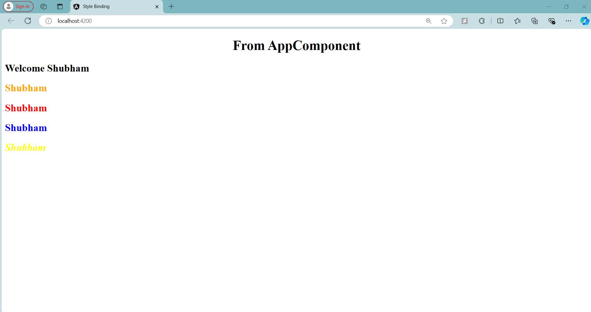

# Angular Style Binding - TestComponent

## Overview

In this step, I learned about **Style Binding** in Angular. Style binding allows you to bind CSS styles dynamically to an HTML element. This can be useful when you want to change the appearance of elements based on certain conditions or component properties.

### **Style Binding Syntax**:

- **Single Style Binding**: `[style.styleName]="expression"`
- **Multiple Styles with `ngStyle`**: `[ngStyle]="objectOfStyles"`

### **Code Explanation**

Here is the code for the `TestComponent` that demonstrates various style binding techniques:

```typescript
import { Component } from '@angular/core';

@Component({
  selector: 'app-test',
  template: `
            <h2>
              Welcome {{name}}
            </h2>
            <h2 [style.color]="'orange'">Shubham</h2>
            <h2 [style.color]="hasError ? 'red' : 'green'">Shubham</h2>
            <h2 [style.color]="highlightColor">Shubham</h2>
            <h2 [ngStyle]="titleStyles">Shubham</h2>
            `,
  styles: []
})
export class TestComponent {

  public name  = "Shubham";
  public hasError = true;
  public isSpecial = true;
  public highlightColor = "Blue";

  public titleStyles = {
    color: "yellow",
    fontStyle: "italic"
  }
}
```

### 1. **Static Style Binding**:
```html
<h2 [style.color]="'orange'">Shubham</h2>
```
- This line statically binds the color `orange` to the `<h2>` element. The text "Shubham" will always appear in orange.

### 2. **Conditional Style Binding**:
```html
<h2 [style.color]="hasError ? 'red' : 'green'">Shubham</h2>
```
- The color is bound conditionally based on the value of `hasError`.
- If `hasError = true`, the text color will be red. If `hasError = false`, the text will be green.
  
In this case, since `hasError = true`, the text "Shubham" will appear in red.

### 3. **Dynamic Style Binding via Property**:
```html
<h2 [style.color]="highlightColor">Shubham</h2>
```
- Here, the color is dynamically bound to the value of `highlightColor` in the component.
- Since `highlightColor = "Blue"`, the text will appear in blue. If you change the value of `highlightColor` in the component, the text color will change accordingly.

### 4. **Binding Multiple Styles with `ngStyle`**:
```html
<h2 [ngStyle]="titleStyles">Shubham</h2>
```
- The `ngStyle` directive allows you to bind multiple styles at once.
- The `titleStyles` object defines multiple CSS properties:
  ```typescript
  public titleStyles = {
    color: "yellow",
    fontStyle: "italic"
  }
  ```
  - This will apply a **yellow** color and make the text **italic**. Both styles will be applied to the element at the same time.

### Final Output:
- The first `<h2>` element displays "Shubham" in **orange**.
- The second `<h2>` element conditionally displays "Shubham" in **red** (since `hasError = true`).
- The third `<h2>` element displays "Shubham" in **blue** (using the value of `highlightColor`).
- The fourth `<h2>` element displays "Shubham" in **yellow** with **italic** font style (due to the `ngStyle` directive).

---

### Screenshot

