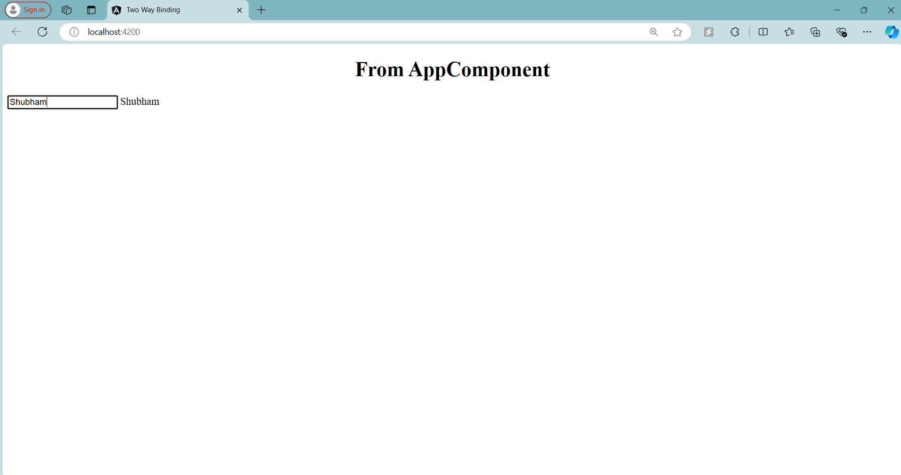

# Angular Two-Way Binding - TestComponent

## Overview

In this step, I learned about **Two-Way Data Binding** in Angular. This concept allows for both property binding (from the component to the template) and event binding (from the template to the component). Essentially, two-way binding keeps the view (template) and the component in sync at all times.

### **Two-Way Binding Syntax**:
- **Syntax**: `[(ngModel)]="propertyName"`
  - This special syntax combines property binding and event binding.
  - The square brackets `[ ]` are for property binding.
  - The parentheses `( )` are for event binding.
  - `ngModel` creates a connection between the template and the component property.
  - To use `ngModel`, you must import `FormsModule` in your `app.module.ts` file.

### **Code Explanation**

Here is the code for the `TestComponent` that demonstrates two-way binding:

```typescript
import { Component } from '@angular/core';

@Component({
  selector: 'app-test',
  template: `
            <input [(ngModel)]="name" type="text">
            {{name}}
            `,
  styles: []
})
export class TestComponent {

  public name  = "";
  
}
```

### 1. **Two-Way Data Binding with ngModel**:
```html
<input [(ngModel)]="name" type="text">
```
- This input field is bound to the `name` property using the `[(ngModel)]` directive.
- The `ngModel` directive establishes two-way data binding, meaning any change in the input field updates the `name` property, and any change in the `name` property is reflected in the input field.
- It effectively combines both **property binding** (to display the value) and **event binding** (to capture changes).

### 2. **Displaying the Bound Value**:
```html
{{name}}
```
- This interpolation simply displays the current value of the `name` property.
- Whenever the user types something in the input field, the value of `name` is updated in real-time, and the updated value is reflected immediately in the view.

### How **Two-Way Binding** Works:
- As the user types in the input box, the value of the `name` property is updated.
- This updated value is immediately rendered through the interpolation `{{name}}`, displaying the typed input in real time.

### Final Output:
- Initially, the `name` property is an empty string, so the input box is empty, and nothing is displayed.
- As you type into the input box, the `name` property is updated, and the entered text is immediately displayed below the input box.

---

### Screenshot


