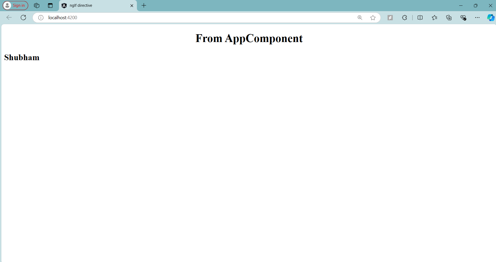

# Angular `ngIf` Structural Directive - TestComponent

## Overview

In this step, I learned about the `*ngIf` structural directive in Angular. The `ngIf` directive conditionally includes or excludes a part of the DOM based on the value of a boolean expression. It is commonly used to render content dynamically in the template depending on a condition.

### **Syntax**:
- **Basic Syntax**: `<div *ngIf="condition">Content to show if true</div>`
  - `condition`: The boolean expression that determines whether the DOM element is rendered.
- **Template Syntax**: `*ngIf` can also be used with Angular's `<ng-template>` to control what content to show when the condition is true or false.

### **Code Explanation**

Here is the code for the `TestComponent` that demonstrates the use of `*ngIf` with `<ng-template>`:

```typescript
import { Component } from '@angular/core';

@Component({
  selector: 'app-test',
  template: `
            <div *ngIf="displayName; then thenBlock; else elseBlock"></div>

            <ng-template #thenBlock>
              <h2>Shubham</h2>
            </ng-template>

            <ng-template #elseBlock>
              <h2>Hidden</h2>
            </ng-template>
            `,
  styles: []
})
export class TestComponent {

  public displayName = true;

}
```

### **Key Elements Explained**:

1. **Conditional Rendering with `*ngIf`**:
   ```html
   <div *ngIf="displayName; then thenBlock; else elseBlock"></div>
   ```
   - `*ngIf` evaluates the `displayName` property in the component.
   - If `displayName` is `true`, the content inside the `thenBlock` template is rendered.
   - If `displayName` is `false`, the content inside the `elseBlock` template is rendered.

2. **Using `<ng-template>` for Then and Else**:
   ```html
   <ng-template #thenBlock>
     <h2>Shubham</h2>
   </ng-template>

   <ng-template #elseBlock>
     <h2>Hidden</h2>
   </ng-template>
   ```
   - The `#thenBlock` template contains the content to display when `displayName` is `true`. In this case, it renders `<h2>Shubham</h2>`.
   - The `#elseBlock` template contains the content to display when `displayName` is `false`. In this case, it renders `<h2>Hidden</h2>`.

3. **`displayName` Property**:
   ```typescript
   public displayName = true;
   ```
   - This is a boolean variable that controls whether the `thenBlock` or `elseBlock` content is displayed.
   - If `displayName` is `true`, the `thenBlock` will be rendered; otherwise, the `elseBlock` will be rendered.

### How **`ngIf` with `ng-template`** Works:
- Angular evaluates the `*ngIf` condition (`displayName`).
- Depending on its value, it either displays the content in the `thenBlock` or the `elseBlock`.
- This approach is useful when you need fine control over conditional rendering with multiple template options.

### Final Output:
- If `displayName = true`, it shows:
  ```
  Shubham
  ```
- If `displayName = false`, it shows:
  ```
  Hidden
  ```

---

### Screenshot

